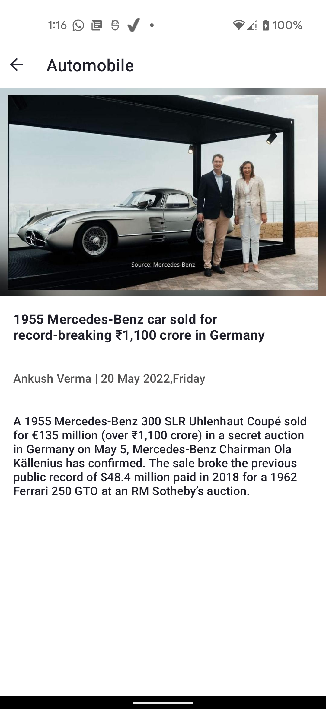
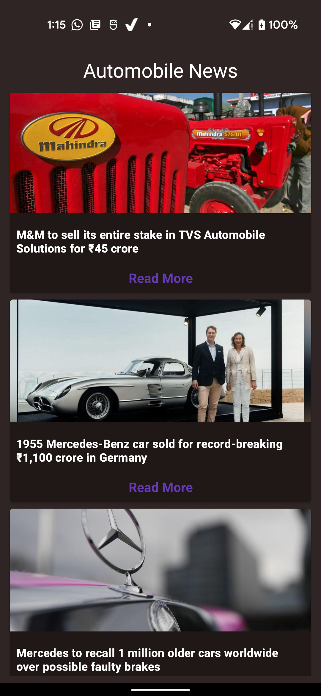
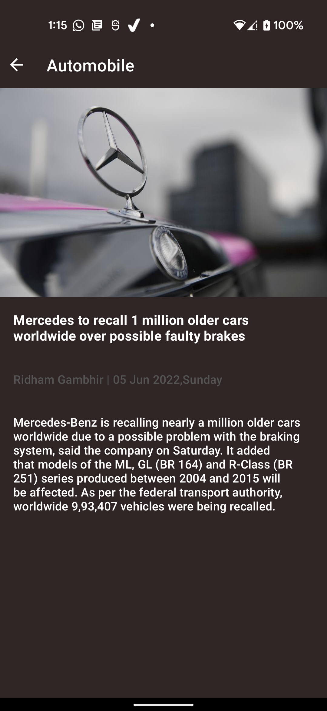

# AutomobileNewsApp
A sample android app to demonstrate MVVM multi-module Clean architecture pattern.

## Tech Stack

- Kotlin 
- Coroutines + Flow for asynchronous 
- Multi-module MVVM Clean architecture
- Material Desgin components
- LiveData and ViewModel
- Data binding and View binding
- Jetpack Navigation
- Hilt - Dependency Injection
- Unit testing using Junit and Mockito
- Retrofit for Network calls
- Glide for image loading
- Toasty to show toasts
- Dark and Light themes available

## Screenshots

| News List Light | News Details Light | News List Dark | News Details Dark |
| ---------- | --------- | ---------- | ---------- |
|  |  |    |   |
